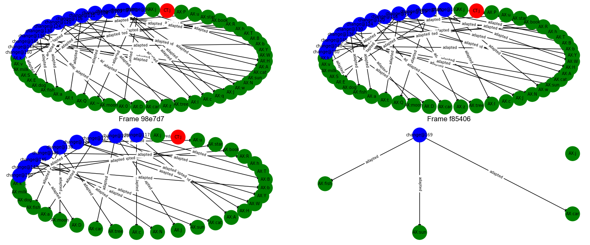

# RIME: Recursive Inference Model Engine

**RIME** is an adaptive, self-evolving reasoning architecture designed to model nested frames of belief, contradiction, and adaptation. Unlike traditional AI systems, RIME does not start with a fixed definition of truth—it constructs its belief system from the bottom up, through repeated interaction with data and persistent contradictions.

> Truth is not defined from the top-down, but earned from the bottom-up through contradiction and adaptation.





---

## 🔍 AI Challenges Solved by This Architecture

This system addresses foundational limitations in traditional AI through a modular, adaptive, contradiction-driven reasoning engine.

| **Challenge**                   | **Traditional AI Struggles With...**     | **RIME's Approach**                                        |
|------------------------------|-------------------------------------------|--------------------------------------------------------------|
| **Symbolic Brittleness**     | Crashes or halts when contradictions arise | Absorbs contradictions into adaptive belief structures      |
| **Grounding Problem**        | Symbols lack real-world experiential link  | Builds truth empirically through repeated input patterns    |
| **Catastrophic Forgetting**  | Overwrites old knowledge with new          | Isolates beliefs in evolving, competing frames              |
| **Training Data Bias**       | Locked into initial dataset assumptions    | Continuously learns from new, live data                     |
| **Black-box Inference**      | Decisions lack transparency                | Traceable logic with trust scores and contradiction history |
| **Single-model Fragility**   | One-model failures cause total breakdown   | Maintains multiple competing, mergeable belief frames       |
| **Closed-world Assumption**  | Fails on unseen or unknown inputs          | Welcomes novelty; defines truth through persistence         |

> 💡 Truth is not imposed — it emerges through tension with experience.

---

## 🚀 Features

- **Contradiction-Driven Adaptation**: Frames learn by identifying and incorporating repeated contradictions.
- **Multi-Frame Reasoning**: Competing frames allow different belief systems to coexist and evolve.
- **Frame Merging & Pruning**: Redundant or weak frames are merged or discarded automatically.
- **Trust-Based Logic**: Inputs raise or lower their trust value over time, influencing belief formation.
- **Persistent State**: System state is saved to and restored from disk using JSON.
- **Full Audit Trail**: Every change is recorded for traceability and explanation.

---

## 🔬 Use Cases

- Epistemic AI / Synthetic cognition
- Belief modeling and contradiction resolution
- Adaptive, context-aware decision engines
- Simulations of social or scientific belief evolution
- Open-world learning systems

---

## 🧠 Core Concepts

### 🧱 Frame (Local Unit)

* Maintains its own logic (axioms).
* Adapts by contradiction or confirmation accumulation.
* Learns by recursively restructuring based on input patterns.

### 🧠 MetaFrameManager (Global Coordinator)

* Selects active frame based on lowest contradiction.
* Spawns new frames when existing ones don't fit.
* Merges frames when they become too similar.
* Tracks long-term abstract patterns and system events.

---

## 🔧 Architecture Overview

### 🧱 Individual Frame Unit

Each **Frame** is an isolated logical entity that:

* Accumulates and revises **axioms** (truths).
* Tracks **contradictions** and **trust** in inputs.
* Evolves autonomously through **adaptation**.

#### Frame Components

| Component        | Description                                           |
| ---------------- | ----------------------------------------------------- |
| `axioms`         | Current accepted truths or beliefs.                   |
| `trust`          | Confidence weights for input patterns.                |
| `contradictions` | Inputs recently found to be inconsistent with axioms. |
| `history`        | Log of structural changes (e.g. adaptation events).   |
| `events`         | Timeline of all evaluations (accept/reject outcomes). |

#### Frame Functions

| Function     | Description                                                           |
| ------------ | --------------------------------------------------------------------- |
| `evaluate()` | Tests an input against axioms, adjusts trust, logs result.            |
| `adapt()`    | Converts contradictions into new axioms when a threshold is exceeded. |
| `score()`    | Returns the frame's fitness as `axioms - contradictions`.             |

#### Frame Behavior

* First two inputs define the notion of consistency.
* Contradictions can later become accepted truths via `adapt()`.
* Trust decays for frequently contradicted inputs.

---

### 🧠 MetaFrameManager — Parent Orchestrator

The **MetaFrameManager** oversees all frames, routes inputs, selects active reasoning paths, and stores global memory.

#### Manager Components

| Component                | Description                                                   |
| ------------------------ | ------------------------------------------------------------- |
| `frames`                 | Dictionary of all Frame instances.                            |
| `active_frame`           | Currently best-fit frame based on contradiction minimization. |
| `meta_abstract_patterns` | Tracks frequently adapted patterns for abstraction.           |
| `event_log`              | Global log of frame switches and system-level events.         |
| `tick`                   | Global time counter.                                          |
| `processed_index`        | Index of last processed input from the input stream.          |

#### Manager Functions

| Function                        | Description                                                       |
| ------------------------------- | ----------------------------------------------------------------- |
| `add_frame()`                   | Adds a new frame dynamically as needed.                           |
| `process_input()`               | Evaluates input across all frames, creates new ones if necessary. |
| `summarize()`                   | Outputs a full state snapshot (scores, patterns, events).         |
| `export_to_csv()`               | Writes axioms, contradictions, and events to disk.                |
| `save_state()` / `load_state()` | Maintains full continuity via `rime_state.json`.                  |
| `merge_similar_frames()`        | Merges frames when they become too similar.                       |

---

## 🔁 Stateful Evolution

| File                            | Purpose                                                   |
| ------------------------------- | --------------------------------------------------------- |
| `INPUT_data.csv`                | Stream of input patterns.                                 |
| `rime_state.json`               | Persistent memory of all frames and global manager state. |
| `OUTPUT_rime_summary.csv`       | Per-frame axioms and contradictions.                      |
| `OUTPUT_rime_events.csv`        | High-level system events (frame switches, adaptations).   |
| `OUTPUT_<frame_id>_summary.csv` | Axioms/contradictions for individual frame.               |
| `OUTPUT_<frame_id>_events.csv`  | Evaluation trace for individual frame.                    |

---

## 📊 Output Files

| File                            | Purpose                                |
| ------------------------------- | -------------------------------------- |
| `OUTPUT_<frame_id>_summary.csv` | Per-frame axioms and contradictions.   |
| `OUTPUT_<frame_id>_events.csv`  | Input evaluation trace for the frame.  |
| `OUTPUT_rime_summary.csv`       | Combined summary of all frames.        |
| `OUTPUT_rime_events.csv`        | Frame switches and global adaptations. |

---

## 📦 Project Structure

| File/Folder                             | Description                                                                                        |
| --------------------------------------- | -------------------------------------------------------------------------------------------------- |
| `RIME_frame_module.py`                  | Self-contained module for a single Frame. Tracks axioms, contradictions, and adapts over time.     |
| `RIME_frame_manager_module.py`          | MetaFrameManager that evaluates and coordinates all Frames. Maintains global memory and evolution. |
| `RIME_frame_manager_graph.py`           | Visualizes the interaction between frames and tracks switching behavior.                           |
| `RIME_frame_graph.py`                   | Visualizes the internal state of each Frame (axioms, contradictions, adaptation history).          |
| `RIME_unified_graph.py`                 | Visualizes both frame interactions and their internal state.                                       |
| `rime_state.json`                       | Persistent memory of all frames and global evolution across cycles.                                |
| `INPUT_data.csv`                        | Input pattern stream for RIME to process.                                                          |
| `OUTPUT_rime_summary.csv`               | Output summary of axioms and contradictions across all frames.                                     |
| `OUTPUT_rime_events.csv`                | Log of global events like frame switching and adaptation.                                          |

---

## 🔁 Important Aspects

1. **Inputs** are read from `INPUT_data.csv`
2. **Frames** evaluate these inputs based on their current axioms.
3. **Contradictions** cause frames to adapt and evolve.
4. **MetaFrameManager** tracks the best-fit frame and manages transitions.
5. **State** is persisted to `rime_state.json` after every run.
6. **Outputs** are written to CSV files for analysis and auditability.
7. Input can be run indefinately without needing to retain past inputs.
8. Can be run and trained in real-time.

---

## 📌 Notes

* Designed to be fully cross-platform.
* Uses only local files, no external dependencies beyond standard Python + matplotlib + networkx.
* Extensible to real-time input streams or symbolic abstraction layers.

---

## 📥 Dependencies

Install required libraries:

```bash
pip install matplotlib networkx
```

---

## 📜 License

This project is licensed under the [Creative Commons Attribution-NonCommercial 4.0 International License](https://creativecommons.org/licenses/by-nc/4.0/).

You are free to share and adapt the code for personal, academic, or non-commercial use, provided that you:
- Attribute the original author
- Link back to this repository
- Indicate any changes made

## 🚫 Commercial Use
Use of this codebase in **commercial applications** or **for-profit systems** requires explicit permission and licensing.  
For licensing requests or custom collaboration, contact:

Tim Isabella
[GitHub Profile](https://github.com/TimIsabella)
https://www.linkedin.com/in/timisabella

---

## ✨ Author

Tim Isabella
[GitHub Profile](https://github.com/TimIsabella)
https://www.linkedin.com/in/timisabella

---


## 🧠 Philosophy

RIME is not a model of truth — it's a model of belief adaptation. It does not assume correctness. It builds coherence by interacting with contradiction.
> "Truth is not what is imposed — it is what survives contradiction."
