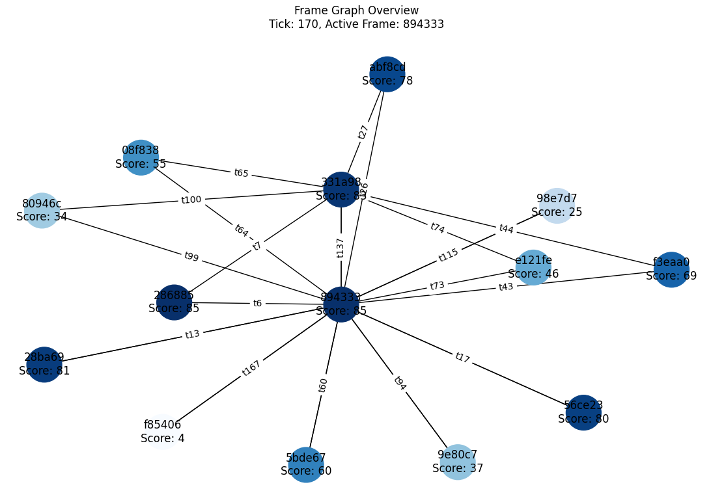

# Recursive Integrated Meaning Engine (RIME)

**RIME** is an adaptive, self-evolving reasoning architecture that models nested frames of belief, logic, and contradiction. It is designed to grow organically by evaluating streams of input and recursively restructuring itself to form higher-order meaning.




---

## 📦 Project Structure

| File/Folder                             | Description                                                                                        |
| --------------------------------------- | -------------------------------------------------------------------------------------------------- |
| `RIME_frame_module.py`                  | Self-contained module for a single Frame. Tracks axioms, contradictions, and adapts over time.     |
| `RIME_frame_manager_module.py`          | MetaFrameManager that evaluates and coordinates all Frames. Maintains global memory and evolution. |
| `RIME_frame_manager_graph_module.py`    | Visualizes the interaction between frames and tracks switching behavior.                           |
| `RIME_frame_graphs.py`                  | Visualizes the internal state of each Frame (axioms, contradictions, adaptation history).          |
| `rime_state.json`                       | Persistent memory of all frames and global evolution across cycles.                                |
| `INPUT_data.csv`                        | Input pattern stream for RIME to process.                                                          |
| `OUTPUT_rime_summary.csv`               | Output summary of axioms and contradictions across all frames.                                     |
| `OUTPUT_rime_events.csv`                | Log of global events like frame switching and adaptation.                                          |

---

## 🔁 How It Works

1. **Inputs** are read from `INPUT_data.csv`
2. **Frames** evaluate these inputs based on their current axioms.
3. **Contradictions** cause frames to adapt and evolve.
4. **MetaFrameManager** tracks the best-fit frame and manages transitions.
5. **State** is persisted to `rime_state.json` after every run.
6. **Outputs** are written to CSV files for analysis and auditability.
7. Input can be run indefinately without needing to retain past input.
8. New input must be a higher row number than the previous input for it to be accepted.
9. Frames are collapsed when they become too similar to another (the more unique frame is retained).

---

## 🧠 Core Concepts

### 🧱 Frame (Local Unit)

* Maintains its own logic (axioms).
* Adapts when contradictions accumulate.
* Learns by recursively restructuring based on input patterns.

### 🧠 MetaFrameManager (Global Coordinator)

* Selects active frame based on lowest contradiction.
* Spawns new frames when existing ones don't fit.
* Tracks long-term abstract patterns and system events.

---

## 📊 Output Files

| File                            | Purpose                                |
| ------------------------------- | -------------------------------------- |
| `OUTPUT_<frame_id>_summary.csv` | Per-frame axioms and contradictions.   |
| `OUTPUT_<frame_id>_events.csv`  | Input evaluation trace for the frame.  |
| `OUTPUT_rime_summary.csv`       | Combined summary of all frames.        |
| `OUTPUT_rime_events.csv`        | Frame switches and global adaptations. |

---

## 📌 Notes

* Designed to be fully cross-platform.
* Uses only local files, no external dependencies beyond standard Python + matplotlib + networkx.
* Extensible to real-time input streams or symbolic abstraction layers.

---

## 📥 Dependencies

Install required libraries:

```bash
pip install matplotlib networkx
```

---

## 📜 License

This project is licensed under the [Creative Commons Attribution-NonCommercial 4.0 International License](https://creativecommons.org/licenses/by-nc/4.0/).

You are free to share and adapt the code for personal, academic, or non-commercial use, provided that you:
- Attribute the original author
- Link back to this repository
- Indicate any changes made

## 🚫 Commercial Use
Use of this codebase in **commercial applications** or **for-profit systems** requires explicit permission and licensing.  
For licensing requests or custom collaboration, contact:

Tim Isabella
[GitHub Profile](https://github.com/TimIsabella)
https://www.linkedin.com/in/timisabella

---

## ✨ Author

Tim Isabella
[GitHub Profile](https://github.com/TimIsabella)
https://www.linkedin.com/in/timisabella

---


## 🧠 Philosophy

RIME is not a model of truth — it's a model of belief adaptation. It does not assume correctness. It builds coherence by interacting with contradiction.
> "Truth is not what is imposed — it is what survives contradiction."
